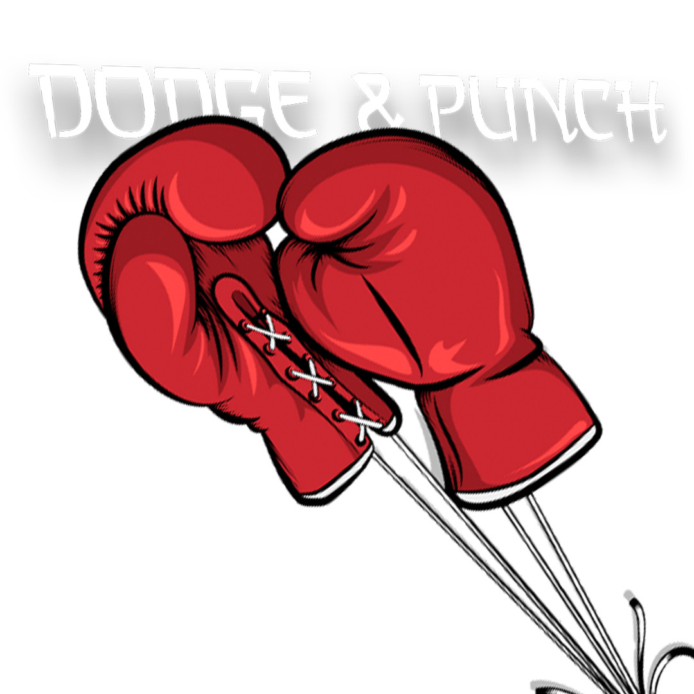

<h1>🥊 Dodge & Punch</h1>

<div align="center">
    </img>
</div>

## 📘 Descrição

**Dodge & Punch** é um jogo de boxe inovador que utiliza visão computacional para criar uma experiência interativa. O jogador assume o papel de um boxeador que precisa se esquivar dos ataques dos inimigos e contra-atacá-los para vencer. O jogo também conta com um sistema de ranking, contabilizando vitórias por nocautes e registrando o recorde de tempo mais rápido para um nocaute, incentivando o jogador a alcançar seu melhor desempenho.

## Autores
Este projeto foi desenvolvido por discente de Engenharia da Computação como parte do projeto final da disciplina Linguagem de Programação I.

- [Eduardo Rodrigues Melo](https://github.com/EduardooXz)
- [João Vitor Amaro de Melo](https://github.com/joaoVitor-amaro)
- [Pedro Henrique](https://github.com/pedroarawj) 

## Objetivo
Este projeto foi desenvolvido como parte do aprendizado na disciplina de Linguagem de Programação. O objetivo foi colocar em prática conhecimentos de C++, Programação Orientada a Objetos (POO), criação de diagramas de classes e uso da biblioteca OpenCV para detectação de objetos e reconhecimento facial.

## 🔨 Ferramentas

- **[Opencv](https://opencv.org/):** Biblioteca de visão computacional detecção de movimentos e processamento de imagens.
- **[C++](https://isocpp.org/):** Tecnologia para comunicar com o Opencv

## Funcionalidades

- **Menu Interativo:** Permite ao jogador iniciar uma nova partida, visualizar o histórico de partidas anteriores e sair do jogo. As interações são realizadas via teclado, proporcionando uma navegação simples e intuitiva pelo menu.

- **Cor Vermelha:** O boxeador deve segurar um objeto de cor vermelha na mão para que a câmera o identifique. Esse objeto permite ao jogador realizar ataques contra o inimigo quando detectado.

- **Atacar:** Quando o objeto vermelho é detectado pela câmera, o boxeador deve acertar uma imagem de um boneco na tela, causando dano ao inimigo. 

- **Defender:** O boxeador deve desviar rapidamente com o rosto de uma imagem de um soco que aparece na tela para evitar tomar dano.

- **Recupear vida:** O boxeador recupera vida ao ficar com pouco de HP. Nesse momento, uma imagem de remédio aparece, e o jogador deve pegá-la com o rosto para restaurar a saúde.

- **Rounds:** Ao final de cada round, o jogador com mais pontos de vida é declarado o vencedor do round e ganha um ponto. Em caso de empate na quantidade de vida, nenhum ponto é atribuído. Após os 3 rounds, o jogador com mais pontos acumulados vence a partida.

- **Recordes:** Os recordes são salvos em um arquivo, incluindo o nome do jogador e o tempo que o boxeador levou para nocautear. Isso permite a criação de um ranking de nocautes.

## Diagrama de Classes

<div align="center">
    </img>
</div>

## Dependências

Este projeto em C++ utiliza funcionalidades da biblioteca padrão do C++, bem como a biblioteca OpenCV para detectação de objetos e reconhecimento facial. Abaixo estão listadas as bibliotecas necessárias e como instalá-las.

## Bibliotecas padrao 
O projeto faz uso das seguintes bibliotecas padrão do C++:

- <**iostream**>: usada para entrada e saída padrão.
- <**vector**>: para manipulação de arrays dinâmicos.
- <**random**>: para geração de números aleatórios.
- <**chrono**>: para manipulação de datas e tempo.
- <**fstream**>: para manipulação de arquivos.
- <**sys/types.h**> e <**signal.h>**: para manipulação de sinais e tipos de dados de sistema.

Essas bibliotecas vêm automaticamente com o compilador C++, então não é necessário instalá-las separadamente.

## Biblioteca Opencv
O OpenCV é utilizado neste projeto para processar dados de imagem e vídeo, incluindo funcionalidades de detecção de cores e reconhecimento facial.

- **opencv2/objdetect.hpp**: módulo para detecção de objetos, usado com frequência para reconhecimento de rostos e outros elementos.
- **opencv2/highgui.hpp**: módulo para interface gráfica, responsável por exibir janelas e capturar eventos do teclado e mouse.
- **opencv2/imgproc.hpp**: módulo de processamento de imagens, com funcionalidades para operações de filtragem, transformação de cores, e muito mais.
- **opencv2/videoio.hpp**: módulo de captura e gravação de vídeo, que permite acessar e capturar vídeo de câmeras ou arquivos.

## Como rodar

Clonando repositorio:
```bash
git clone https://github.com/joaoVitor-amaro/boxe-opencv.git
```

### Linux ou Mac
#### Requisitos
- Possuir o compilador do c++, o **g++** ou o **clang++**
- Terminal de linha do comando

Instalando o Opencv
```bash
sudo apt install libopencv-dev
```
Compilar o projeto
```bash
g++ main.cpp -o main `pkg-config --cflags opencv4` `pkg-config --libs --static opencv4` 
```

Executar o projeto:
```bash
./main
```
