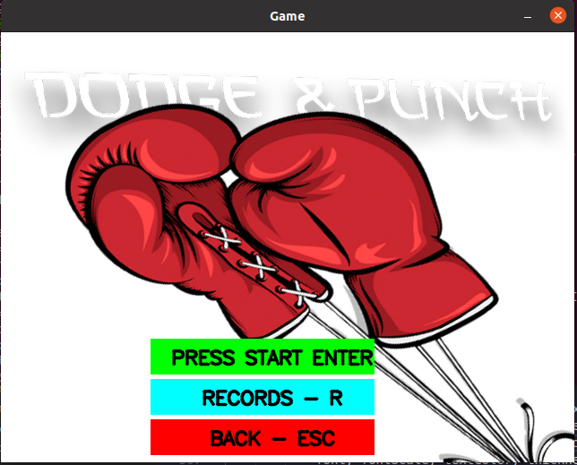

<h1>🥊 Dodge & Punch</h1>

    </img>

## 📘 About

**Dodge & Punch** e um jogo desenvolvido por discente de Engenharia da Computação como parte do projeto final da disciplina Linguagem de Programação I.

## Autores

- [Eduardo Rodrigues Melo](https://github.com/EduardooXz)
- [João Vitor Amaro de Melo](https://github.com/joaoVitor-amaro)
- [Pedro Henrique](https://github.com/pedroarawj) 

## Object
O objetivo foi desenvolver um jogo utilizando a biblioteca Visão Computacional(OpenCv) junto com c++, proporcionando uma experiência visualmente atraente e dinâmica

## 🔨 Tools

- [C++](https://isocpp.org/)
- [Opencv](https://opencv.org/)

## Features

- **Menu Interativo:** Iniciar a partida, visualizar o historico e sair da partida, utilizando o teclado para interagir com o Menu.

- **Defender:** O boxeador tera que desviar de uma imagem de um soco na tela para não levar dano. 

- **Rounds:** Uma luta completa possui 3 rounds, cada um durando 40 segundos, caso o jogador/inimigo seja nocateado, a partida acaba.
  
- **Animações:** Utilização de sons quando os boxeadores e atingido, ataca ou pega a frutinha de recuperar vida, alem do jogo possuir musica de fundo.